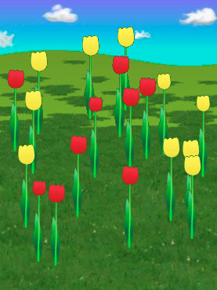
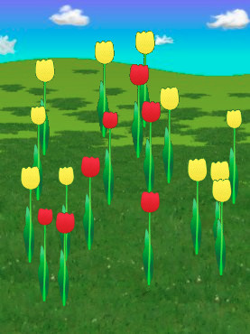
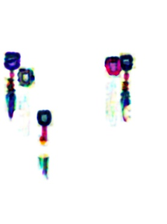

# diff image utils

Diff image to check whether objects have changed.

> It use [SSIM](https://en.wikipedia.org/wiki/Structural_similarity) algorithm to diff image, then [threshold](<https://en.wikipedia.org/wiki/Thresholding_(image_processing)>) image, finally check the percent of dark color in threshold image.

## Install

- install opencv 3.x

For linux

```
git clone https://github.com/opencv/opencv
mkdir opencv/build
cd opencv/build
cmake ..
sudo make install
```

For mac

```
brew tap homebrew/science
brew install opencv@3
brew link --force opencv@3
```

- install npm package

```
npm install @sigodenjs/imagediff
```

## Usage

```js
const { diffFactor, diffImage } = require('..');

const img1 = fs.readFileSync("img1.jpg");
const img2 = fs.readFileSync("img2.jpg");
const factor = diffFactor(img1, img2);
const img = diffImage(img1, img2);
fs.writeFileSync("/tmp/imgdiff.jpg", img);
```

| img1                        | img2                        | diff                       | score |
| --------------------------- | --------------------------- | -------------------------- | ----- |
|    |    |    | 0.047 |
|  |  |  | 0     |

## License

Copyright (c) 2018 sigoden

Licensed under the MIT license.